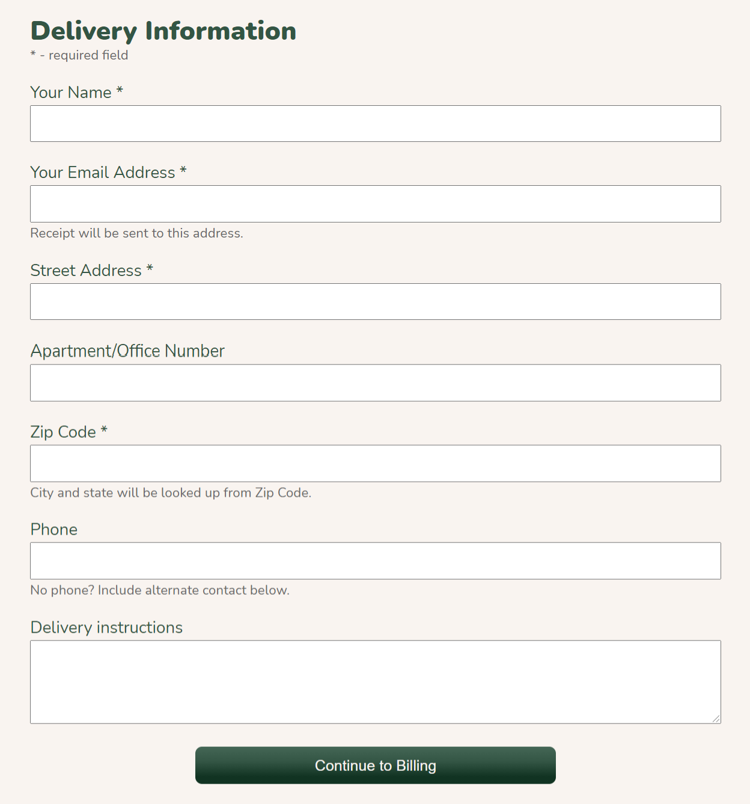

# Accessibility
Sources: [Accessibility for Web Developers](https://teamtreehouse.com/library/accessibility-for-web-developers) | [Web Accessibility Compliance](https://teamtreehouse.com/library/web-accessibility-compliance)

### Contents

- [🌐 WCAG Overview](#-wcag-overview)
- [:curly_haired_woman: User groups to keep in mind](#curly_haired_woman-user-groups-to-keep-in-mind)
- [🛠️ Tools for Accessibility Auditing](#%EF%B8%8F-tools-for-accessibility-auditing)
- [:pencil: Accessible forms](#pencil-accessible-forms)

-------------

## 🌐 WCAG Overview
The [Web Content Accessibility Guidelines (WCAG)](https://www.w3.org/WAI/standards-guidelines/wcag/) state that in order to be accessible, interfaces must follow **4 principles** (*POUR* - see below). WCAG 2 introduced **13 guidelines** to meet these principles, further broken down into **78 success criteria**. Two great resources for learning these are:
- [Exploring The New Success Criteria](https://www.levelaccess.com/wcag-2-1-exploring-new-success-criteria/)
- [13 Days of Accessibility](http://a11ycalendar.kaseybon.com/)

The success criteria are at **3 levels**: A, AA and AAA. On the modern web, achieving level A compliance should be easily within reach, and level AA should be the minimum accessibility standard for most projects.

- **Perceivable** - information and user interface components must be presentable to users in ways they can perceive. This principle is all about providing alternative methods of understanding your web content. Its guidelines cover:
  - *text alternatives* (e.g. `alt` attribute)
  - *time-based media* (e.g. providing captions and transcripts)
  - *adaptable* (e.g. use semantic HTML in a logical order; interfaces should be navigable in portrait as well as landscape orientation)
  - *distinguishable* (e.g. colour contrast; combine multiple visual cues incl. messaging/iconography rather than relying on colour alone to convey information; avoid auto-starting audio or video; website can be resized to 200% without loss of content/functionality)
- **Operable** - users must be able to operate your interface without barriers. This principle covers:
  - *keyboard-access* (navigable via tab key; no keyboard traps; have obvious focus indicators and logical focus order)
  - *enough time* (users should be able to adjust or remove time limits on bookings etc. if they need extra time)
  - *seizures + physical reactions* (allow users to disable distracting content; avoid animations that flash more than 3 times/second)
  - *navigable* (use proper HTML structure of [headings in a logical hierarchy](https://usability.yale.edu/web-accessibility/articles/headings) and semantic containers - this also helps skip content that is repeated on multiple pages, such as navigation; provide a descriptive page `<title>` tag; purpose of a link should be clear from the link text, i.e. avoid 'click here' being the link)
  - *input modalities* (provide alternatives to complex interactions, e.g. complex touch screen gestures; use generous target sizes)
- **Understandable** - users with disabilities must be able to understand your content:
  - *readable* (use plain language; set language attributes appropriately so screen readers know how to pronounce content correctly - see example below)
    ```html
    <html lang="en">
      ...
      <body>
        <p>Main text is in English</p>
        <p lang="fr">Sauf pour cela qui est écrit en mauvais français</p>
      </body>
    </html>
    ```
  - *predictable* (create predicable navigation; avoid unexpected changes in context: opening a new window, loading a new page, significantly rearranging page content or moving focus to a new component should only happen in response to clear user interaction)
  - *input assistance* (make errors easy to spot and correct; when reporting form errors: make messages easy to notice and understand, highlight errors visually, keep instructions simple and accessible)
- **Robust** - content must be robust enough that it can be interpreted by a wide variety of user agents, including assistive technologies:
  - *compatible* (write valid HTML; use semantic markup; appearing [status messages](https://www.w3.org/WAI/WCAG21/Understanding/status-messages.html) don't receive focus + use an appropriate role so they can be perceived without interrupting the user)


## :curly_haired_woman: User groups to keep in mind
> "Whereas usability considers how easy a site is to use and understand, accessibility is concerned with whether you can get there at all." - *[Article discussing the differences and overlap between usability and accessibility](https://ncdae.org/resources/articles/cognitive/)*
#### For visual impairments
- Use good colour contrast
- Use accessible fonts such as Arial, Calibri, Century gothic, Helvetica, Tahoma and Verdana
- Make sure images have descriptive `alt` text where appropriate

#### For audio impairments
- Provide subtitles and captions for videos
- Provide transcripts
- Include context explaining the video

#### For motor impairments
- Provide global navigation menu
- Ensure users can navigate through keyboard
- Avoid dynamic and gesture-based content

#### For cognitive impairments
- Provide clear steps and direction
- Allow the user to focus on one thing at a time
- Provide sufficient context


## 🛠️ Tools for Accessibility Auditing
- Turn your CSS off so you can see a simpler version of the site
- Zoom to 200% and ensure all parts of your site can still be accessed
- [W3C HTML Validator](https://validator.w3.org/) and [validator.nu](https://html5.validator.nu/) for HTML validation
- [Lighthouse](https://developers.google.com/web/tools/lighthouse)
- [WebAIM colour contrast checker](https://webaim.org/resources/contrastchecker/)
- [Axe](https://www.deque.com/axe/) and [WAVE](https://wave.webaim.org/extension/) - browser extensions to evaluate web accessibility
- [Treehouse Accessibility Checklist for web devs](https://treehouse-project-downloads.s3.amazonaws.com/Accessibility-for-Web-Developers/Accessibility-Checklist-for-Web-Developers.pdf)


## :pencil: Accessible forms
Checkout forms tend to have a huge abandonment rate, and whilst some of this may be due to users not wanting to commit to a transaction, [studies by the Baymard Institute](https://baymard.com/lists/cart-abandonment-rate) have found that a significant proportion of abandonments are due to problems with checkout form usability.

### Principles of an accessible form
- *Avoid unnecessary questions* (common one: asking for people's telephone number - this should be optional, with a way for the user to specify an alternative ways of being contacted)
- *Minimize questions per screen* - benefits: faster loading; screenreaders can jump straight to the relevant information; correcting errors is easier with a limited set of fields; the presentation simplification reduces cognitive load - which benefits all users but especially those with cognitive disabilities
- When 'chunking' a form (breaking it into steps), *provide context clues* - e.g. remind users of the purpose of the form, clearly label current step, how many tasks have been completed/how many remain
- *Group related questions* (both visually and via screen-reader accessible HTML) - especially important when multiple sets of questions need to stay on the same screen / cannot be 'chunked' into separate steps
- *Use clear input labels* - using just placeholder text is not good enough, as it disappears once the user starts typing, and can cause users to lose track of which field they were filling out. Also, remember that "[form labels are not a medium for creative expression; they’re a tool for users to know how to use a form](https://alistapart.com/article/designing-for-cognitive-differences/)". Don't sacrifice usability/accessibility for the sake of fancy form animations etc. 
- *Make focus indicators obvious* (via additional styles against the `:focus` pseudo class) to help users who are unable to use a mouse, and ensure the entire form can be navigated by keyboard
- *Help users spot and correct errors* through easily understandable error messaging and highlighting of issues


### HTML recommendations
- Use `<fieldset>`s to group related questions in a form.
  - fieldsets must have a legend
  - fieldsets should not be nested within each other
- The `for` attribute of a `<label>` needs to match the `id` attribute of the `<input>` in order to properly associate the two. This also increases the area that can be interacted with, meeting the WCAG's call for generous target sizes.
- Use pre-defined input `type` attributes where appropriate, e.g. `type="email"` or `type="tel"`
- `placeholder`s can cause colour contrast issues (two light and they will be hard to see, too dark and they will look like filled in text). Consider using input masks instead to suggest how a field's content should be formatted.
- See *[HTML Notes > forms & inputs](https://github.com/minkaotic/front-end-notes/blob/master/notes/HTML-Notes.md#forms--inputs)* for further notes about HTML forms.

**Example form**
```html
<form>
  <fieldset>
    <legend>Deliver Information</legend>
    <p class="hint">* - required field</p>
    <label for="name">Your Name *</label>
    <input type="text" id="name" name="user-name">
    <label for="email">Your Email Address *</label>
    <input type="email" id="email" name="user-email">
    <p class="hint">Receipt will be sent to this address.</p>
    <label for="address1">Street Address *</label>
    <input type="text" id="address1" name="user-address1">
    <label for="address2">Apartment/Office Number</label>
    <input type="text" id="address2" name="user-address2">
    <label for="zip">Zip Code *</label>
    <input type="text" id="zip" name="user-zip">
    <p class="hint">City and state will be looked up from Zip Code.</p>
    <label for="phone">Phone</label>
    <input type="tel" id="phone" name="user-phone">
    <p class="hint">No phone? Include alternate contact below.</p>
    <label for="delivery-instructions">Delivery instructions</label>
    <textarea type="text" id="delivery-instructions" name="user-delivery-instructions"></textarea>
    <button type="submit">Continue to Billing</button>
  </fieldset>
</form>
```
This will produce the following form: 

### Textual guidance for users
- Be as clear as possible in your label text, i.e. "Your Email Address" rather than just "Email", to help users with cognitive impairments
- Clearly mark required fields with textual hints
- Consider adding information alongside an input clarifying why this data is collected, i.e. `<p class="hint">Receipt will be sent to this address.</p>`
- In a multi-step (multi-page) form, clearly reflect the progression pathway in the submit button text, i.e. "Continue to Billing Details" rather than just "Continue" or "Submit"
- Confirmation messages [should state](https://alistapart.com/article/designing-for-cognitive-differences/#section7):
  - what action was taken ("Thank you for signing up for our newsletter!")
  - what data was posted ("Your email address, {email_address}, has been added to our distribution list.")
  - what the user should do if they made a mistake ("If you want to stop receiving our newsletter at any time, you can unsubscribe on your user profile.")

### Error messages / validation
- Highlight both input and label of fields that fail validation, for example by adding styleable classes to both:
  ```js
  <label for="email" class="error-text">Your Email Address *</label>
  <input type="email" id="email" name="user-email" class="error-input">
  ```
- Make use of iconography to highlight the failed field without purely relying on colour
- Provide specific instructions for fixing the issue, i.e. "Email address must contain a single @." rather than just "Invalid email address"


